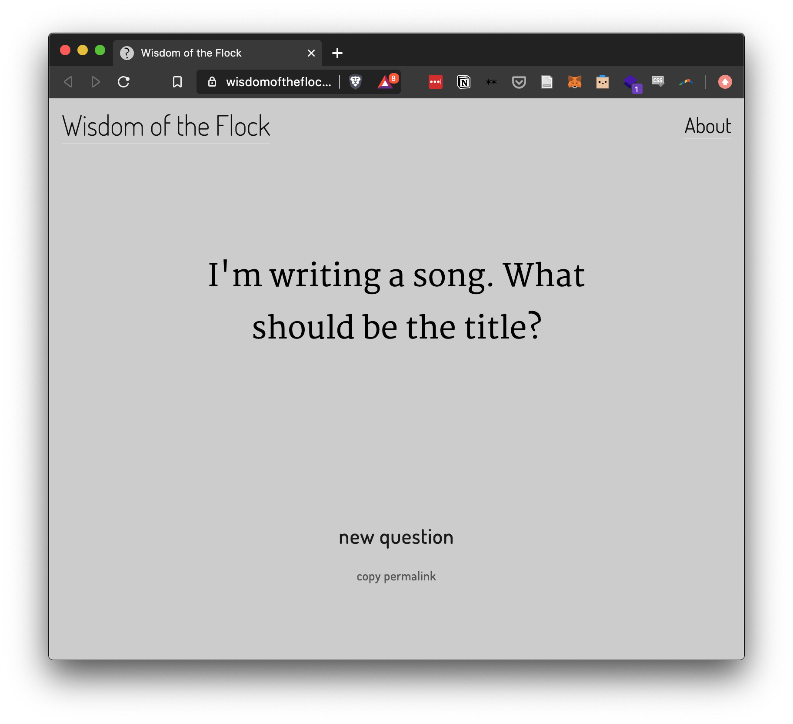
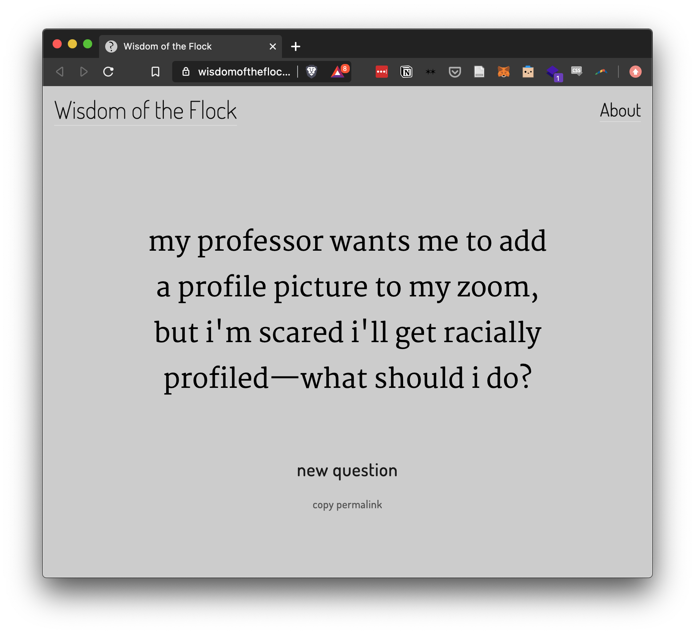
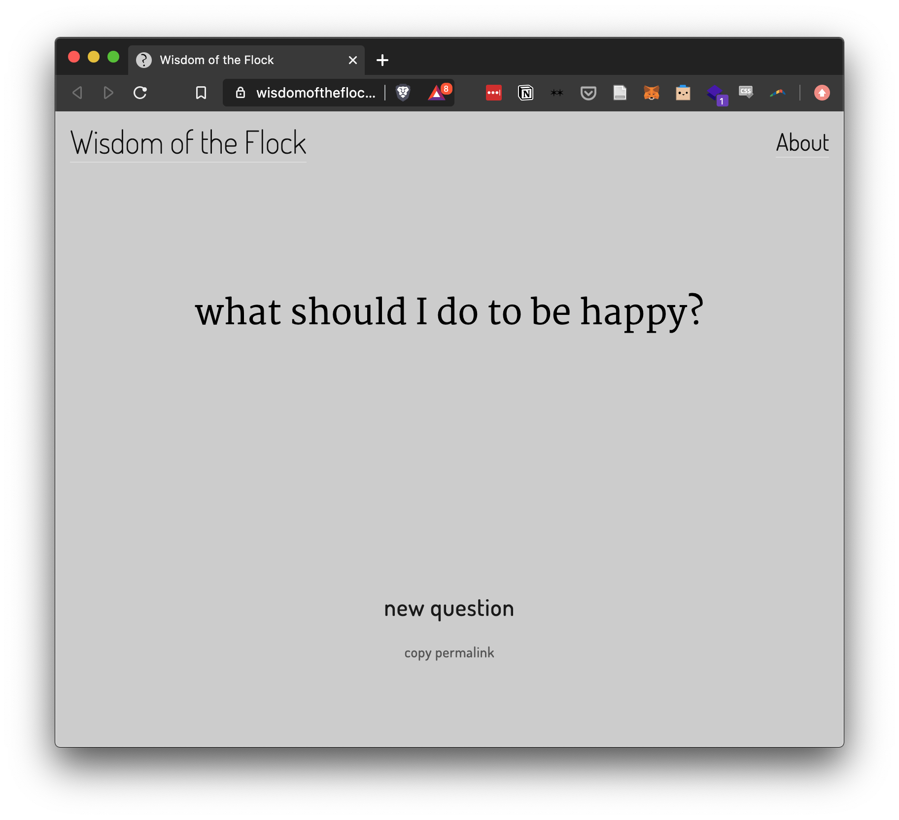

After only having an "Under Construction" landing page up for a few months, I've finally let [Wisdom of the Flock](https://wisdomoftheflock.com) go live this week! I'll do a technical write-up on it at some point but wanted to talk through my thinking behind it on the week of its "official" launch. 

What started the project was a tweet about how some user with a relatively large following was particularly good at crowdsourcing information from their followers. Their audience became a resource for recommendations when traveling, finding information about niche topics, etc. That comment made me wonder how people in general use their followers as a source of collective intelligence to answer questions, and what kinds of questions people asked. 

There's a specific kind of question I was interested in though: a question that required some moral or value judgement about how someone is supposed to act in the world. These are "should" questions and they're all asking some authority for guidance. On Twitter, the authority is mainly your group of followers, so I wondered what topics do people trust that group to answer for them? 

I set up a Twitter bot to listen to the giant firehose of all posts in search of questions (there had to be a question mark) with phrases like "how should," "what should," and "why must" that require some kind of value judgment to answer. They're seeking a "right" answer when there isn't one. Other question formats like "where is," "what is," and "how does" are primarily seeking objective information about the world, so I ignored all of those. The interesting part to me about the "should" type of questions is that they can ultimately only be answered by the person asking them. 

I got... a lot of results. An overwhelming number. So many that I wasn't worried about missing some due to bot downtime or my restrictions like needing a question mark, because there are so many questions captured that it's all I can do to go through them as is. Which brings up another point: I'm hand-curating all of the tweets that appear on the site. 

The problem with displaying all of the raw questions would be that there are a lot of tone and context clues that can't be easily filtered on. As well as a lot of redundancy without verbatim duplication. I have a post-processing filter that separates out some common variants of "What should I eat for dinner" and "What should I watch/stream next," for example, because those come up a lot. I'm also trying to filter out rhetorical questions as much as possible, which is impossible to do in an automated way. 

The goal is to display the full range of genuine questions asked with minimal overlap. These questions can be mundane, funny, political, heartbreaking, and everything in between, and they illustrate how differently people use the platform and their network on it.

Given the range of questions, I wanted to display them one at a time. Minimal noise, no responses shown, each question given equal weight. Just asking the viewer to face the question and sit with it. 

The filters I used took out any tweets that were direct responses to other tweets or aimed at specific people, tweets that included links or polls, and tweets that included more than a small number of hashtags or mentions. These filters helped cull ads and "growth hack" type tweets but the main reason was that I wanted to only display tweets that were meant to stand on their own. It's not a perfect system, but it means that none of the tweets shown originally had any obvious supplementary materials to contextualize them. What you see here was all that was given in the first place. 

As of this writing there are about 1,200 tweets being used in the live version, and many thousands more pending curation. I was originally going to wait to let this go live until I was done curating but decided to just put it up now and slowly add more as I work my way through my backlog, so the library will be growing and changing over time. 

This is my first attempt at what I'd consider a digital art piece, and I'm hoping to do more investigations like this into how people use online spaces. Thanks for being interested in the journey.

## Small Stuff

- The [Trust reading group](https://trust.support/events/collective-reading-with-joanna-games-agency-as-art) this week was on the book *[Games: Agency as Art](https://global.oup.com/academic/product/games-9780190052089?cc=us&lang=en&#)* by C. Thi Nguyen. There's a great [summary of the book](https://philpapers.org/archive/NGUPOG.pdf) by the author available, which is more succinct and accurate than anything I could write here, but I loved his idea of looking at the set of games as a library teaching different types of agency, and I highly recommend at least reading the summary.
- Cross-sensory metaphors always fascinate me, and I found a new one this week: describing food by where it lands on a frequency spectrum. Before writing about games and agency, C. Thi Nguyen used to be a food writer, and he wrote [this post about hot sauces](https://objectionable.net/2020/08/11/a-theory-of-hot-sauces-with-recommendations/) a few months ago. In it, he describes most boutique hot sauces as having "too much broadband complexity" but later finds a chipotle sauce with the desirable "low, toasty, bass-note rumble." I'd never thought to describe food that way, instead reaching for more physical metaphors like "sharp" or "round", but those same descriptors can also map directly to frequency. The fact that it *makes sense* amazes me - another flavor of synesthesia.
- I started a discord this week for some friends to just have a place to put interesting links and discussion ([DM me](https://twitter.com/keaton_sa) if you want an invite, it's certainly open to anyone reading this!). I hadn't engaged with discord until recently but I love how it feels like we're building a collaborative knowledge base on top of having individual discussions. The themed channel separation and searchability add a lot, so I highly recommend setting one up, even for a small group of people.
- I found [PolicyKit](https://policykit.org/) a few weeks ago, a project led by [Dr. Amy Zhang](https://homes.cs.washington.edu/~axz/) to bring customizable, programmable methods of governance to online communities, and I'm in the process of trying to integrate it into my new discord server. Most online communities have a strict, essentially authoritarian Admin/Moderator/User hierarchy and this is designed to allow more flexibility in how communities self-govern. In my own server already I've found that I'd like to make a policy that new channels can be created by a proposal and x number of approvals, which this could handle. I'll have more updates as I implement this.
- I fell down a small rabbit hole reading about Nordic Larping this week. I always associated larping with essentially stage combat with foam medieval gear, but I learned it's a much broader-ranging term, with Nordic larping being extremely character- and atmosphere-driven. I recommend looking into [this readymade role-playing system](https://whenourdestiniesmeet.files.wordpress.com/2013/07/when-our-destinies-meet-130711.pdf), [this summary of Nordic larping](https://nordiclarp.org/what-is-nordic-larp/), and this fantastic article on [agency, motivation, and decision-making](https://nordiclarp.org/2020/04/27/maps-loops-and-larp/).
- Finally, wear a mask. Stay home. A "4-week" (surely to be extended) set of restrictions went into effect this past Monday here in Seattle prohibiting any indoor social gatherings with people from outside your household and prohibiting indoor dining, among other things. I'm not really equipped to comment on how poorly this is being handled and treated by the public, but there needs to be stricter and stronger measures and this step is better than nothing. One of the many faces of fatigue we're all facing is decision fatigue from having to choose right action within such an uncertain and conflicting information landscape, and it's looking to be a long, hard winter.

(hm, this "small stuff" section could just be its own post... whoops.)

## Reading

- Finished reading [Geography of Home](https://www.goodreads.com/book/show/162712.Geography_of_Home) by Akiko Busch this past week, which was lovely, if dated at times. I talked about it a little bit [last week](https://ksarmentrout.com/blog/weekly-post-11-15-20). It was helpful for inspiring some meditation on how we interact with the spaces in our homes and what they mean, especially given how much time we're all spending at home.
- I've started into [Underland](https://www.goodreads.com/book/show/53121631-underland) by Robert Macfarlane which I'm looking forward to. I've always found works of art centered around time to be very compelling, like the [Future Library Project](http://futurelibrary.no/) and [As Slow As Possible](https://en.wikipedia.org/wiki/As_Slow_as_Possible), and this book seems to be an exploration of deep time and our place within it.

Until next time,

\- Keaton
