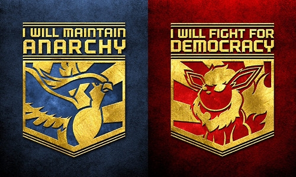
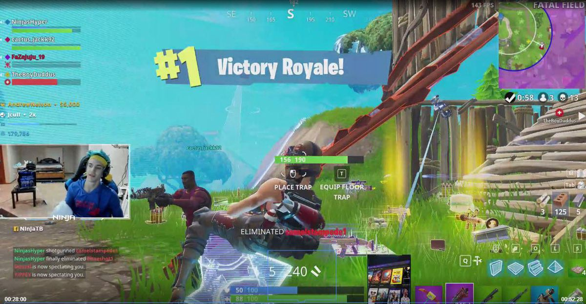

When one thinks of worldbuilding, they might think of extended fantasy epics that have grown beyond the scope of their original medium, like Lord of the Rings or Harry Potter. Those are *worlds*! They're not just books, they have faces and voices to the characters, physical recreations of some locations, games you can immerse yourself in. They really *exist* in a high-dimensional space! How did that happen though?  What makes those seem more *real* than others, and what even is a world?

---

## What is a World?

> "A World is a future you can believe in: one that promises to survive its creator, and continue generating drama."

This is the definition given in [*Emissary's Guide to Worlding* by Ian Cheng](https://worldto.live/), in which he talks about "Worlding" as a craft. The goal of Worlding is to create a World that satisfies those two criteria to give it some measure of "aliveness." The vibrancy that exists in the wizarding world of Harry Potter gives you an innate feeling for how fantastically alive that World is, and it's because it scores very high in both of those categories. 

First, it promises to survive its creator. If J.K. Rowling dies tomorrow, there is no chance that the world of Harry Potter vanishes with her, because there are too many instances and artifacts of the World around to perpetuate it. It has sunk so deep into the pop cultural zeitgeist that there's no fear of it coming to an abrupt end. As far as I can tell, that World can exist indefinitely from the support and additional creations of its fan base that engage with it to keep it alive. 

Second, it continues to generate drama, meaning it stays interesting! Cheng's definition of drama includes "problems that trigger interesting new paths in a World, that arouse its members in unexpected ways, without causing total collapse." Even if the plot lines of the original series protagonists have "ended" within their original scope, more characters and adventures can be soundly set within the World without destroying it by stretching it too far away from its original formulation. It's robust. The canonical addition of "Harry Potter and the Cursed Child" is the most direct example of this: continued drama within a cohesive World. 

---

## Declarative and Interactive Containers

It's easy to look at such an established World and comment on how well established it is, though. All new Worlds have to come from somewhere and a key decision when creating a new World is what medium to use for its initial foundation. This medium Cheng calls a "container" and he draws a distinction between two types: *declarative* and *interactive*.

Declarative containers are what you probably expect them to be: things that tell you about a world. Our Harry Potter example started as a declarative container, a series of books that described a World. They continued with even more declarative containers, the series of movies, before branching out further. 

Here's where it broadens out: a lot of things can fall under the scope of "interactive container." A video game certainly is interactive, but also necessarily has some declarative elements: you're fed cutscenes of exposition and just straight up told about what's going on in the world. Purely interactive containers might be physical objects or places given with no explanation. A car, for example. A coat. A restaurant. Things that you interact with to get value from but give you information about the World you're inhabiting only implicitly. 

Ian Hubert, a wizard with 3-D modeling software Blender, has a phenomenal talk on [World Building in Blender](https://www.youtube.com/watch?v=whPWKecazgM) in which he discusses his mindset behind modeling objects in an environment. In his case the end result is for a declarative container like a movie, but the line of questioning is exactly the same: what are the rules of the world that led to the specific features of this object, and what implications do they have on others? 

In his talk he mentions small details about the world like the buildup of oils on a part of a door people walk through every day, or wet footprints diverging across a floor. He also talks about reader boards like in the image above: that particular sign hasn't changed in years so he enjoys watching the message cycle in and out of relevance "like an old friend." If that's the interactive (and admittedly also declarative, though just barely) container you're given, what does it tell you about the world surrounding it? About the success of that business in the area, or about the person running it? 

Some general "rules" of the world that dictate details of physical objects can be inferred, or at least some of its priorities. What's the climate based on the clothing? What manufacturing processes are preferred, and what does that tell you about the industry of the area? Did this object come from near or far away? Who was the object intended for? 

Ultimately, both declarative and interactive containers are needed to completely flesh out a world, but the choice of initial container dictates the context of someone's first encounter with your world and can depend on how you feel best able to carry it out. Cheng gives a rule of thumb for how a world can develop from its first instantiation: 

> If you value the pragmatic realization of the eventual World: interactive container > declarative container. If you value the fantastical potential of the eventual World: declarative container > interactive container.

---

## Gaming as Rapid Iteration of Worlding

For about 10 days in the winter of 2014 I was glued to one singularly influential Twitch stream: Twitch Plays Pokemon. You can [read the arc of the story](https://www.engadget.com/2014-02-22-twitch-plays-pokemon-its-history-highlights-and-bird-jesus.html) and a description of the events, but it doesn't compare with being immersed in the community during those two weeks. 

The stream was technically the main event, but the accompanying subreddit was where the full World was being forged. It held plan proposals for coordinated efforts, meta-commentary on how the stream was being run, and myths and legends borne from the semi-random actions of Red, the in-game character. There was a palpable energy to the collective discovery of the narrative: Pokemon were given personalities and grand-scale motivations, factions of support formed and broke, people celebrated every victory, and mourned the release of Pokemon on what came to be known as Bloody Sunday. A complete dramatization surrounding and subsuming Red emerged and solidified in real time. 

The Pokemon game at Twitch Plays Pokemon (TPP)'s core *is* an interactive container, but the structure around it added another level of interactivity, effectively using Pokemon Red as a basis for a new vibrant, alive, derivative world where people rapidly generated supplementary declarative containers like fan art and meta-narratives to flesh out the world. You could say that TPP was a world with extremely loose creator's hold, which [survived its creator](https://www.polygon.com/2019/2/12/18221792/twitch-plays-pokemon-anniversary) and continued to create drama with a community able to run wild with its own reinterpretations. 

Six years on and the streaming world is hugely influential, to say the least. An article talking about "[gamerbait](https://8ball.substack.com/p/gamerbait)" points to the influx of musicians and brands bringing gaming culture into the fold of their own content, from [Balenciaga launching a video game](https://videogame.balenciaga.com/) to concerts in Fortnite by [Marshmello](https://www.youtube.com/watch?v=NBsCzN-jfvA) and [Travis Scott](https://www.youtube.com/watch?v=wYeFAlVC8qU). The motivating reason behind these big moves though is because:

> the most important social space for Zoomers isn’t the disco like it was for Boomers or the grunge bar like it was for Gen X or the DIY venue like it was for Millennials—it’s the Twitch stream, it’s the Discord server, it’s the video game.

Put another way, the primary social focal points for gen z have moved from declarative containers for Worlds to interactive ones. Making the backdrop of your social gatherings an interactive container creates an environment where it is both more likely and easier to create spontaneous narratives. These narratives might lend themselves to making supplementary declarative containers and in effect allow groups of people to practice collective Worlding. 

Streaming itself is a practice of Worlding by building additional declarative and interactive containers around a central world. This is why there can be so many successful streamers who stream the same games, because the worlds they've each created live within the community, the fan art, and the narratives collaboratively built between the chat and the streamer spanning across multiple game arcs. The "original interactive container" being streamed defines a world in its own right, but also serves as a backdrop to numerous meta-worlds being built on its shoulders.

In the Small Stuff section of my [first weekly post](https://ksarmentrout.com/blog/weekly-post-001) I mentioned the book [Games: Agency as Art](https://global.oup.com/academic/product/games-9780190052089?cc=us&lang=en&#) by C. Thi Nguyen, in which he talks about the set of games as providing a toolbox for different types of agency. By playing different games and adapting to different rulesets, we are stretching our concepts of how we interact with the world by "trying on" different methods of doing so. The same is happening here: by using interactive containers like video games as a basis for building up an online community, we're able to practice building up different Worlds around them, and further able to experience different Worlds by bouncing between many different streamer communities, each with their own drama, rules, and aliveness. 

The side effect of rapid iteration of Worlds, however, is a continued fracturing of media culture into smaller communities, articulated by Jay Springett as "[cultural fracking](https://www.thejaymo.net/2019/08/27/097-fracking-whitney/)". His term refers to how mass media producers can only continue making money by exploiting pop culture giants from a past time when mass culture was more comprehensive. In this highly volatile scene of Worlds being created and dying again, there's a similar phenomenon: these Worlds start from "load-bearing" cultural touchpoints and use them as the basis of building new spaces until the spaces can stand alone. Signs indicating that a streamer has created a sufficiently alive and autonomous may include streaming lesser-known or more offbeat games without losing viewership, showing that the streamer's World can stand alone without as much of a need to lean on the popularity of the base interactive container being streamed.

From the standpoint of a game developer, does this mean that games will start to shift from tightly sealed, self-contained Worlds to games made to be a backdrop for further iteration? How do you make a game so that it's both distinctively recognizable but still flexible for derivative Worlds to spin off from it?  Can this happen starting from more declarative artistic mediums like music or visual art? 

And most importantly, what Worlds are you helping build? 

---

# Small Stuff

- Slides on [Building technology for society (and all of its complications and messy consequences): case study on automated content moderation](https://social.cs.washington.edu/slides_content_moderation.html) by Dr. Amy Zhang from the new Social Futures Lab at the University of Washington. Really great overview of some issues in online content moderation with jumping-off points to further research.
- [Anatomy of an AI System](https://anatomyof.ai/) art piece slash years-long investigation to put together the most complete picture possible of what goes into the creation of an Amazon Echo. Phenomenal work, staggering in its scale. By Kate Crawford and Vladan Joler (2018).
- A pretty comprehensive list of [ML-based art Colabs](https://github.com/dvschultz/ml-art-colabs). Colabs are cloud-based code notebooks, and this github repo contains a ton of options for getting started in ML-based art generation, including image standards like DeepDream, StyleGAN, and DeOldify, but also text generation with GPT-2, and audio generation!
- Finally, a talk from Larry McEnerney at UChicago on ["The Craft of Writing Effectively."](https://www.youtube.com/watch?v=vtIzMaLkCaM) This talk is for a very specific purpose, namely how to succeed with academic writing, but particularly in the first half McEnerney brings up a lot of points that were helpful for me personally to hear as someone with an entirely STEM background. He stresses the importance of the reader, the incongruence between why you write a piece and why the reader would be reading it, and points out that "You've learned to write in a system where you're writing to readers who are paid to care about you." Oof.

Until next time,

\- Keaton
