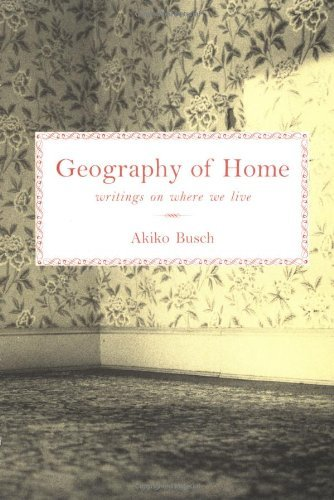

Music is a gaseous thing. It expands to fill any space it's in and tinges it with an emotion. Once a song becomes entangled with a place, a time, a person, hearing that song again later brings you immediately back. Music is a tether between a feeling and a context. 

There's a reflexive relationship that develops. Music helps define the character of the space as much as the space helps shape the character of the music. David Byrne starts his book [*How Music Works*](https://www.goodreads.com/book/show/13235689-how-music-works) with a discussion of this interplay, further suggesting that the development of musical genres has been guided by what sounds good within their available venues. 

I'm interested in this relationship between a song and a specific place, how much they influence each other. This is certainly an incomplete list, but there are a few levels to this interaction covered here, ordered in vaguely increasing directness: places evoking songs, changing songs, and finally creating songs.

## Places Evoking Songs

One of my favorite are.na channels is [playlist prompts](https://www.are.na/shea-fitzpatrick/playlist-prompts), which collaboratively and vibrantly explores many different relationships with music. The prompts range from specific, literal aspects of the songs ("electronic music with noteworthy flute parts") to very abstract interpretations ("music that feels like wet clay"), and the beauty of this list is how many specific moods the prompts evoke. These will be wildly different for each person based on their interpretation. "Songs that have been sung to you", for example takes me though a mental catalogue of intimate house shows, nights out to karaoke bars, childhood lullabies, and vulnerable one on one performances, with all the emotional whiplash of compiling such a varied list. 

Many of the prompts also revolve around specific locations and contexts. "A song for each bedroom you've had." "A playlist for unpacking all of your things in a new home." "Music for underpasses." "Music to listen to while wandering a museum."

These are possible because each of these specific locations can have a set of feelings associated with it that you'd want to reflect with the playlist. When you're wandering through a museum, what feelings brought you there? What thoughts are you having, and how do you feel surrounded by art or history or science and in no particular rush? The songs in this theoretical playlist create these same feelings on their own, further amplified by their link to a place where you're already in those same moods. The link between music and context has been made via curation. 

I recently read *Geography of Home* by Akiko Busch, a series of vignettes written in the early 90s for *Metropolis* magazine where each vignette is about a specific room in a stereotypical American house. While the references keep much of the writing squarely set in 1993, some of the chapters reach back into the historical contexts of each room to look at how they arrived at their current form. The most interesting historical overview has been for the front door. As our relationship between public and private spheres is constantly renegotiated and that tension plays out in our architecture, what role does the front door as a reception area have while most people with garages and side doors routinely ignore it as a matter of practicality? Or, more generally phrased by Busch, "Isn't there an enormous difference between something that is never used and something that is useless?"

Reading *Geography of Home* led me to think a little more deeply about the role of the spaces I inhabit, which may become playlist prompts themselves: "music for entryways;" "songs for each street you've lived on;" "music you've heard neighbors play through the walls".

## Places Changing Songs

When you hear a sound, it has been shaped by whatever environment you're in. A microphone (including your ear) is an impartial listener awash in sound from all directions, capturing reflections and echoes from surfaces around it as well as the original sound source. This is why recording studios put so much time and careful planning into the construction of a recording room: each room has a character to it that will come through in whatever is recorded there. 

Even if you're not listening in a "space" and instead piping music directly into your head via headphones, the construction of the of those headphones dictates how the music sounds. Smaller speaker sizes are worse at reproducing lower frequencies, for example, leaving music more "tinny" or "hollow" sounding. Your experience of music is *always* shaped by the mechanics of how it reaches your ear.

Instead of evoking a particular place by matching the mood with songs, you can instead *change* a song to mimic how it would sound in that place. For example, think about the wide open spaces and reflective walls of a church. By adding long reverb tails and echo to a recording, dragging the remnant of each note out long after it is done playing, you can recreate the acoustic effects of a church and ground the listener into the environment that way. There's a genre of youtube video with the approximate formula "<song> but <x>" that does this style of environment building. 

`youtube: https://www.youtube.com/watch?v=9mBpYzwmDx8`

In this case, it doesn't really matter what the song is. There are a few different "<song> but you are in a bathroom at a party" videos and they all work as long as the song is something that you could expect to hear while actually at a party. The reason why they work is because the physical space of the bathroom changes how you perceive the song, so mimicking those changes immediately creates a sense of place. The link between music and place has been made via modification. 

This type of worldbuilding goes beyond "what would you listen to at a place?" and asks "how are you hearing the music while you're at that place?" 

## Places Creating Songs

Ólafur Arnalds in 2016 released an album "Island Songs" with an accompanying movie documenting its creation, meant to be a "portrait of Iceland." Made across 7 weeks in 7 different locations with all Icelandic artists, this project is a celebration of Icelandic art and culture and tries to capture the intangible qualities of that country along with its history within the music. 

`youtube: https://www.youtube.com/watch?v=JiWwwYClEs0`

It's of course entirely subjective whether Iceland comes to mind when hearing any particular track from the album. It's entirely possible that some people from Iceland would disagree with the album being an accurate portrayal of the country at all. The process, though, starting from a place and working backwards to discover what sounds best fit the location, is a very direct confluence of music and context. At the very least, it's a look into how a given musical artist interprets their experience of that place. Here, the link between music and place has been made via creation.

What happens when you play Island Songs in a gallery space? At a party? A sporting event? The introduction of this music into any of these other venues would recontextualize it, taking it further out of Iceland and creating a backdrop for another place entirely, which most likely wouldn't fit the emotional demands of the space (thinking here mostly about the absurd pairing of ambient piano music in a football stadium). Island Songs not only wasn't developed for these other places, but *couldn't have been written at all* if those were the only contexts available.

Returning to David Byrne's discussion in *How Music Works*, places not only create music by inspiring people to write, but also by guiding the types of sounds people like to write:

> In a sense, we work backward, either consciously or unconsciously, creating work that fits the venue available to us. ...In a sense, the space, the platform, and the software "makes" the art, the music, or whatever. After something succeeds, more venues of a similar size and shape are built to accommodate more production of the same. After a while the form of the work that predominates in these spaces is taken for granted — of course we mainly hear symphonies in symphony halls.

Much like how technology enables new forms of music (think microphones leading to crooning vocalists and samplers leading to modern hip-hop, as examples), the venue space itself is a technology that influences what music is written by imposing constraints on what music sounds good. The link between music and place is implicit: the aspects of the music are the results of a process of evolution guided by the spaces they're written for. 

~

 

Can music ever be fully decontextualized? No, and that's a good thing. Recordings divorced music from the artist's presence, and streaming services further divorced music from dedicated physical media, but music can never exist in a vacuum separate from the spaces it came from and the ones it is experienced in. 

---

# Small Stuff

- The [Balenciaga video game](https://videogame.balenciaga.com/en/game) launched this past Monday continuing to build out the world of [digitized fashion](https://www.are.na/keaton-armentrout/digitized-fashion). While there were aspects of the experience that made me laugh out loud at the absurdity, the in-browser 3-D experience is technically very impressive and the modeling of the clothes is incredibly detailed and well done.
- [GENUARY](https://genuary2021.github.io/) is starting next month, essentially a month-long coding challenge loosely centered around visual code and automata, but generally "where we build code that makes beautiful things." The [prompts](https://genuary2021.github.io/prompts) are already available and look fun to participate in. This might be the thing that finally gets me to actually learn [Processing](https://processing.org/)!
- I learned about [Oblique Strategies](https://en.wikipedia.org/wiki/Oblique_Strategies) by Brian Eno, a card deck with instructions or prompts for helping break out of creative blocks. There have been 5 editions including the original in 1975 and they've been used most famously by Eno during the recording of David Bowie's albums in Berlin but also by many bands since. There are iPhone apps with all card deck versions available, for the next time you need help working through writer's block.

---

# Reading

- This week I read *A place that exists only in moonlight* by one of my favorite artists, [Katie Paterson](http://katiepaterson.org/). She's the artist behind the inspiring [Future Library Project](https://futurelibrary.no) (which if I haven't talked about so far, I certainly will again), and this book reads as a precisely-written inventory of [ideas](http://katiepaterson.org/portfolio/ideas/), showcasing her wonderfully inventive cross-medium thinking. Each page has a three-line description of an idea, the book's title being one example. Some favorites include "A wave machine hidden inside the sea" and "A lifetime of air extracted from ancient ice." You can [buy a unique digital copy](https://www.justgiving.com/fundraising/katie-patersonideas) with proceeds going to Scottish Women's Aid.
- I finally finished the last half of *A Responsibility to Awe* by Rebecca Elson that I discussed in [Weekly Post 002](https://ksarmentrout.com/blog/weekly-post-002). The second half consisted of curated excerpts from her notebook, showing her iterative process developing themes and containing beautiful unpublished poems. I recommend this book in general, but especially to anyone in STEM interested in seeing their field masterfully romanticized.

Until next time,

\- Keaton