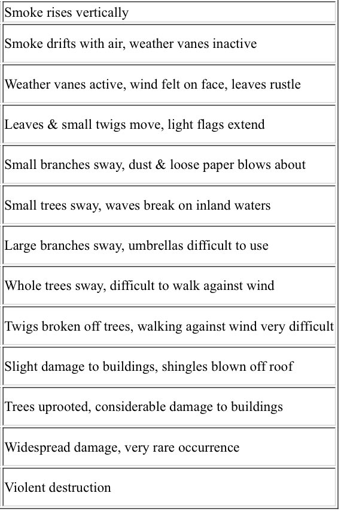

I wouldn't have guessed that last-minute Christmas gifts this year would be other people's tweets. 

That's exactly what happened when [Cent](https://beta.cent.co/~discover/)'s [Valuables](https://v.cent.co/) exploded onto a very specific scene at the beginning of the week, letting people "Buy tweets autographed by your favorite creators."  Here's how it works: you make an offer on Cent to buy a tweet for some amount of cryptocurrency and the tweet author gets a notification about the offer. If the author accepts, they go onto Cent and approve the offer (this is the "autographed" part, though it's really just a "consent to the sale"). Cent creates a unique [non-fungible token (NFT)](https://bravenewcoin.com/insights/what-is-an-nft) representing the tweet and the author makes money from the sale! 

Congratulations, you've now "purchased" a tweet! Of course, the tweet stays where it is. It still lives on Twitter on the author's account, and the author retains the rights to delete the tweet at any time because this process doesn't actually interact with the Twitter platform directly. So what's... the point? 

Valuables makes a secondary market out of other people's cultural IP. What you've purchased is "symbolic" ownership of the tweet, but "actual" ownership of a derivative asset created from the tweet. Here's where some notions of ownership get a little fuzzy, so let's take a detour into them before hitting some of the new developing use cases.

## Whose Tweet is it Anyway?

Katherine Hayles, writing in 1999 about virtual bodies and cybernetics in *[How We Became Posthuman](https://press.uchicago.edu/ucp/books/book/chicago/H/bo3769963.html)*, observed a shift in how we exist virtually that I often use to contextualize how value arises online: digital media focuses on **pattern vs. randomness** as opposed to **presence vs. absence**. 

Applying this to ownership, what does it mean to own a statue? Well mostly it means you can choose to sell it, where to put it, and who gets to look at it. You control access, where access necessarily means sharing the same physical space as the statue. If someone really wants to look at your neat statue but you keep it locked up somewhere, they're out of luck. Sure, people can take pictures of it and send those around, but anyone who has seen a work of art that really resonated with them knows that seeing the iPhone-captured version alone wouldn't have had the same effect. When you own a physical object, you have sole agency over when and where it exists, meaning you control access by granting or withholding its presence.

What about when some object *only* exists virtually and can be reproduced losslessly? If that iPhone-displayed version is the same as any other version because that's the context it's meant for? Control over presence is only really possible until that object is copied by a 3rd party, which for many digital platforms is constantly happening thanks to projects like the [Wayback Machine](https://web.archive.org/), after which the content is out of the author's hands. A tweet, for example, stops being a "possession" and starts being an asset that the author can control access to via pattern recognition. From Hayles: 

> Whereas possession implies the existence of private life based on physical exclusion or inclusion, access implies the existence of credentialing practices that use patterns rather than presences to distinguish between those who do and those who do not have the right to enter. Moreover, entering is itself constituted as access to data rather than as a change in physical location.

Let's say then that a tweet author has "partial gatekeeping ownership" of the original tweet, partial because it doesn't extend to any of the copies/screenshots/backups of the tweet and because is shared by Twitter whose servers it actually lives on (remember even with digital-first assets, there are physical instantiations somewhere!). 

The author controls access according to rules that make up Hayles's "credentialing practices": is a viewer blocked by the author? Does the viewer have a Twitter account? Has the tweet been deleted? 

Going back to Valuables, when you buy an NFT for a tweet, you get "symbolic ownership" of it. You have zero agency over the content of the original tweet itself and can do nothing to gate access to it, but you now own a new, unique pattern that you can make your own set of rules and credentialing requirements around. 

Despite these two assets both being digital-first, being a tweet author is closer to the presence/absence concept of ownership, while being the NFT owner is closer to the pattern/randomness concept of ownership, which comes with [new implications for liquidity and transferability](https://opensea.io/blog/guides/non-fungible-tokens/#Blockchain-based_non-fungible_tokens). 

Less than one week after the launch of Valuables, we're already seeing people use the secondary marketplace in innovative and unique ways.

## Evolving Use Cases

Shortly after Valuables dropped, people started figuring out inventive ways of using them, driving more dynamic interactions around the concept than simply "I bought this tweet." There are many more collected in [this thread](https://twitter.com/niftytime/status/1340700766818844672?s=20) but I wanted to highlight my favorites here. 

1.

Grammy award-winning artist RAC has fully embraced the use of NFTs for creative releases, previously creating an [Ethereum-based community token with Zora](https://blog.ourzora.com/home/introducing-rac). Soon after Valuables came out, he used the concept to create a Twitter-exclusive music drop that he advertised and auctioned off "ownership" of. Again, the music file is easy to rip from Twitter and distribute so this isn't a matter of presence/absence, but ownership of a brand new derivative pattern with its own liquidity (and, honestly, bragging rights). 

<blockquote class="twitter-tweet tw-align-center">
&gt;&gt; <a href="https://twitter.com/Cent?ref_src=twsrc%5Etfw">@cent</a> allows anybody to buy tweets. only 1/1 available.   &gt;&gt; to play with this concept, I created a unique piece of music yesterday.   &gt;&gt; several people have bid on it, current offer is $350.   &gt;&gt; I&#39;ll accept the highest bid Dec 22 at noon PST. <a href="https://t.co/v2IBrSK6k3">https://t.co/v2IBrSK6k3</a> <a href="https://t.co/jwDrNZaqUP">https://t.co/jwDrNZaqUP</a>
&mdash; RAC (@RAC) <a href="https://twitter.com/RAC/status/1341123259341783040?ref_src=twsrc%5Etfw">December 21, 2020</a></blockquote>

2.

Crypto artists can sell Twitter announcements of new art and/or further explanations of them, creating packages bundling a work with its backstory. This can add depth to an art collection by offering artist commentary or process updates along with each piece.

<blockquote class="twitter-tweet tw-align-center">
COLLECTOR ALERT  If you own any of my <a href="https://twitter.com/hashtag/cryptoart?src=hash&amp;ref_src=twsrc%5Etfw">#cryptoart</a> and you bid $1 on the tokenized tweet announcement for that piece, I will accept so you have the set. Just DM the link to the art and I&#39;ll verify.
&mdash; Coldie (@Coldie) <a href="https://twitter.com/Coldie/status/1340369148837199872?ref_src=twsrc%5Etfw">December 19, 2020</a></blockquote>

3. 

Emoji art! Why not just use Twitter as a primary vehicle for an artwork? 

<blockquote class="twitter-tweet tw-align-center">
☁️ 🌕  . 🚀  🌊 🗻 🌴🏢🏭🏬 🟦🟦🟦🟦🟦🟦🟦🟦🟦🟧🟧🟧🟧 🟦🟦🟦🟦🟦🟦🟧🟧🟧🟧🟧🟧🟧 .F L Y - M E - T O - T H E - M O O N.
&mdash; TwistedVacancy (@twistedvacancy) <a href="https://twitter.com/twistedvacancy/status/1341592845031854081?ref_src=twsrc%5Etfw">December 23, 2020</a></blockquote>

The world of crypto art and NFTs in general have already generated new concepts of digital ownership and asset distribution ([Foundation](https://foundation.app/) and the previously mentioned [Zora](https://ourzora.com/) come to mind) so I'm excited to see how new use cases develop.

---

[**Update 12/28/20:** Given the topic, I decided to [additionally post this to Cent](https://beta.cent.co/ksarmentrout/+5jrv5n)!]

---

# Small Stuff

- [New Urgency](https://new-urgency.net/): a curated archive of ideas around critical design and speculative futures
- [Gamerbait](https://www.8ball.report/p/gamerbait) continues with [KFC Gaming](https://twitter.com/kfcgaming) and [KFConsole](https://www.bbc.com/news/business-55433318)
- Bitcoin keeps breaking all-time highs. Just wanted to mention.
- The Beaufort wind scale as poetry ([posted by @nontanne](https://twitter.com/nontanne/status/1342332499679182848?s=12)):

    

Until next time,

\- Keaton