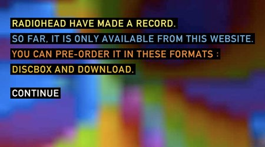
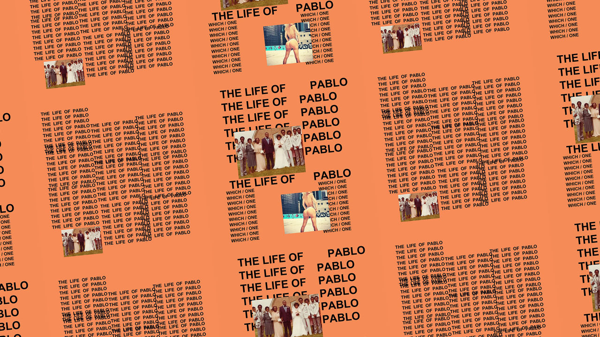
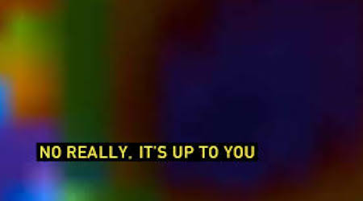

I remember being stunned in late 2007 when a friend told me that Radiohead put their latest album up for free. I went home from school that evening and rushed to the family computer only to find a colorful, blurry splash page with a small block of text saying the buying window had already closed. Devastating for middle-school me who didn't want to spend money but also wasn't cool enough to torrent the album. 

For weeks that moment stuck with me. They were just... giving it away for free? I felt like if only I'd heard about it earlier and downloaded it, I would have been getting away with something very sneaky. What a mistake they made, I could have just put $0 and fooled the system! 

Jumping forward to 2021 where the "pay what you want" paradigm is widespread and readily accepted on platforms like Bandcamp, there is indeed an argument to be made that it was a mistake. In the years following, the landscape has changed from listeners paying for multiple albums to find artists they like to artists putting their music up for free and paying for targeted advertising or playlist placements. Writing shortly after the promotion shut down in December 2007, [CNET reported](https://www.cnet.com/news/radiohead-criticized-as-band-shuts-down-in-rainbows-promotion/) "[Radiohead manager Chris Hufford is] not saying the promotion was a bust, but neither is he hollering 'Eureka, we've discovered the new paradigm!'" So the stunt wasn't celebrated as a huge financial success at the time but rather just an interesting experiment. Even two years on in 2009, NPR wonders if the stunt worked and ponders if "[fractions of pennies per play ever replace booming 1990s CD revenue](https://www.npr.org/sections/monitormix/2009/11/the_in_rainbows_experiment_did.html#:~:text=major%2Dlabel%20representation.-,In%20Rainbows%20was%20first%20released%20on%20Oct.,up%20to%20collect%20voluntary%20payments.)". 

The seismic change in music abundance, pricing, and consumption, obviously aren't solely the result of Radiohead's innovation. It was spurred on by the relentless rise in streaming popularity, and in its wake musicians continue to innovate new methods of releasing and distributing their music. 

[As a musician myself](https://mossives.com), I've been watching the space with some interest, so I've kept track of some of my favorites. A few of them seemed to fit nicely into categories so widely used on the internet that they're nearly cliches at this point, but it's still how I'm going to cover them: as abundance or scarcity. 

## Revising Releases

There's an art to structuring and promoting a music release that covers both the lead-up and the follow-up to make sure that the big day doesn't go unnoticed and the music doesn't go unheard. But the rewards today for a single moment of release are shrinking as audiences demand constant engagement. As new media artist Hito Steyerl writes:

> The artist has to be present... And not only present, but exclusively present, present for the first time, or in some other hyperventilating capacity of newness. Artistic occupation is being redefined as permanent presence.

It's getting harder and harder to run off to a cabin in the woods to write an album and expect your fans to still be there when you return. 

In response to the constant engagement first allowed by, then demanded by, new technology, a new method of music release emerges: music as iteration. 

With primarily virtual releases, there doesn't have to be anything inherently special about releasing one *single, final* version. Jay Springett argues: 

> One of the features of the digital media environment is the ability to have control over source files. The idea that an ‘artwork’ is done when it is released into the world is – in my opinion – over.

In his recent article "[Early Access Artists](https://www.thejaymo.net/2020/12/08/early-access-dweb-artists/)" where that quote is from, he points primarily to the [multiple iterative versions of Kanye's "Life of Pablo"](https://www.complex.com/pigeons-and-planes/2020/02/album-changes-kanye-west-prototyping)  as the first and most influential example of music release taking on more of a software release cadence. There ended up being multiple different configurations made for different platforms and contexts, including at least 3 separate versions before the full album (with additional content changes) was made available more widely on all streaming platforms. 

A different take on album revision is the "[instant deluxe edition](https://www.billboard.com/articles/columns/hip-hop/9391339/hip-hop-deluxe-edition-trend-lil-baby-uzi-vert-nav)" recently used by artists like Lil Baby and Lil Uzi Vert in 2020 to drive attention to recent releases and keep them  afloat on Billboard charts for a few weeks longer. Drastically shortening the usual delay between an album and its deluxe edition follow-up maintains the spirit of iteration rather than separating the new material into a separate release, which keeps audiences' attention on a unified project. 

The hamster wheel of content generation many artists find themselves in drives more and more granular releases, but also gives artists the opportunity to use their audiences as an active part of the creative process. [Championxiii tests out freestyle verses](https://www.rollingstone.com/pro/features/tiktok-championxiii-freestyles-1097255/) on his 2.4 million TikTok followers before committing to make any of them into fully produced songs, letting the audience response inform whether a song will be a hit or not when it's finally released. Speaking about that process, he explains:

> "I don’t like to waste resources. I don’t need to take chances. Before I put any more effort into a freestyle, I’m gonna make sure it’s what [my audience] want[s]."

Looked at together, these practices are turning what has typically been a one-off event into a generative conversation between artist and audience that may end up mutually beneficial. Interested fans can get a closer look at the production process and sneak peeks into upcoming full releases, while artists can get a better sense of what sounds their most-engaged audience will like. 

## Evolving Sounds

As I write this I'm listening to a version of ["Riquiqui" by Arca](https://riquiqui.arca1000000.com/) that doesn't have an end time. On my first listen through, it stopped after roughly 42 minutes. 

This is a unique generative version of the song made in collaboration with [bronze.ai](http://bronze.ai), an intentionally secretive company that develops generative machine learning techniques as compositional tools for artists. But possibly even more compellingly, is developing "an audio file format which will revolutionise music playback, enabling artists to release non-static, generative, augmented music."

Bronze takes the concept of music as iteration a step further and lets a song continue to evolve on its own. Depending on how the proposed file format works, the Kanye-style release revisions may even go from being *like* software releases to *actually software releases*. Purely speculation here, but once someone has a digital download of such a format, the original artist may be able to push updates to the generative capability of the file. Which would be really cool as long as it doesn't end up like the time [U2 force-pushed their new album](https://www.eonline.com/news/1071481/remember-when-apple-forced-a-u2-album-on-us-all#:~:text=It's%20been%20five%20years%20since,iTunes%20subscriber's%20personal%20devices%2C%20unasked.&text=September%209%2C%202014%20started%20out%20like%20any%20other%20day.) to *everyone*. 

The end result then of music as iteration is that you're left with an abundance of it. Following the generative version of "Riquiqui" mentioned above, Arca released "Riquiqui;Bronze-Instances(1-100)", 100 discrete variations on the same song made collaboratively with [bronze.ai](http://bronze.ai) totaling to 5 hours and 50 minutes of music. Certainly an abundance, and an intimidating body of work to sift through. It's almost a comical response to the culture of sub-3 minute pop songs to release a nearly 6-hour monolith made from one single. 

Another notable example is [Sigur Rós 24-hour "Route One"](https://18seconds.sigurros.com/routeone/), which was made using a different generative software on stems of their song "Óveður". The band did release the full 24 hour version, but also curated the results into a second, much more reasonably-sized 40-minute album also called "Route One" that is basically a highlight reel of the full performance. 

This process of AI-assisted overproduction trimmed down by artist curation can potentially add another dimension to the iterative music release cycle by either creating full albums from individual preexisting songs, as Arca and Sigur Rós have done, or by extending songs into remixed or elongated singles. 

---

I'm going to stop there for now, saving the second half of this piece on scarcity in music release for next week. In the spirit of revising releases, I'll update this post to include a link when that next half is up.

---

# Small Stuff

- Researchers at UPenn [characterized different curiosity-based information-seeking methods](https://www.researchgate.net/publication/346541359_Hunters_busybodies_and_the_knowledge_network_building_associated_with_deprivation_curiosity) by quantifying their Wikipedia browsing behaviors into graphs. "Deprivation sensitivity," a new term for me that refers to the drive to eliminate gaps in knowledge, informs how these graphs are constructed: higher sensitivity leads to greater clustering and tighter networks. You get a direct visualization of how someone's curiosity works! Research lead Dr. Lydon-Staley has [a great summary explanation of the paper on Twitter](https://twitter.com/dlydonstaley/status/1333448297462312963?s=12).
- [A Twitch streamer was banned for not owning the rights to her own body.](https://www.theverge.com/2020/11/24/21591488/projekt-melody-twitch-ban-copyright-strike-digitrevx-vtuber) The Verge covers how Vtuber Projekt Melody was temporarily banned from Twitch when the artist who designed her avatar claimed she didn't own the copyright to it. It's one thing to be stripped of a logo and need to rebrand, but when someone commodifies their entire virtual presence that they may want to maintain for privacy or personal safety reasons, the stakes for who owns the IP become much higher.
- I stumbled upon a long-running [Twitter thread of thrift store graphics](https://twitter.com/lycheecola/status/1025841115201597440?s=12) full of vintage and eclectic designs that's worth browsing through.

Happy New Year and welcome to 2021! 

I usually make a few specific New Year's Resolutions each year, and one of them for 2021 is to make one of these posts every week. They will most likely change in character (I'm considering breaking personal updates plus Small Stuff into a separate stream from main post content, for example), and might become an actual newsletter, but it'll be something I'll feel out as I go along. For now, I'm just looking forward to the practice of it, and I hope whoever chooses to spend time with me on this journey enjoys the ride. 

(Another resolution should probably be to make these posts shorter, because phew!) 

Until next time,

\- Keaton