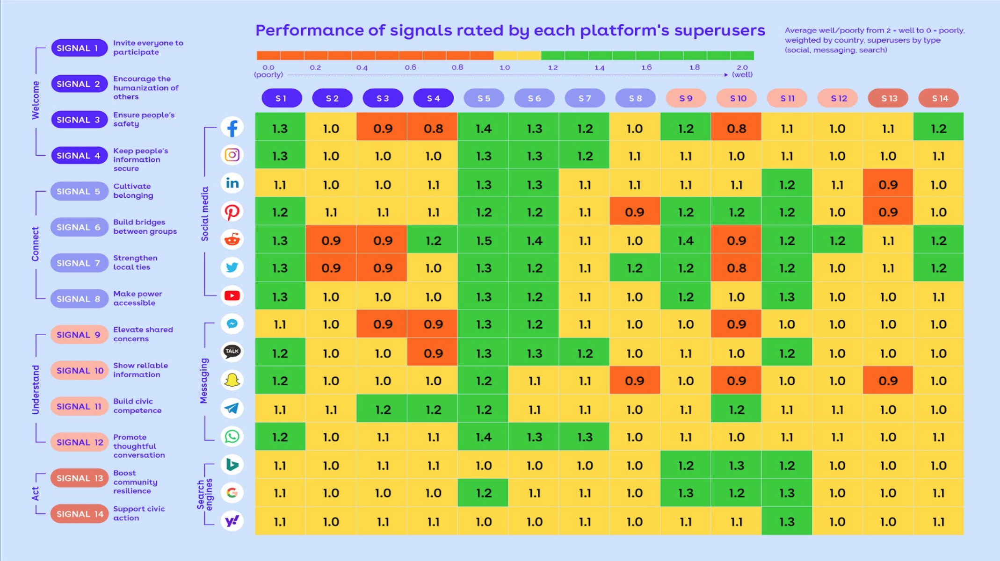

When the radio revolution swept the world, there was no unified vision for what it was supposed to be. In the USSR, its first emergence was as a medium for propaganda; hardly anyone owned their own radio but everyone listened to it from factory buildings and town squares, so it could be used effectively by the state. In the US, radio evolved capitalistically, starting primarily with the National Broadcasting Company (NBC). Private companies formed with their own stations and programming, resulting in ad-supported commercial radio. The British model was different still, led by the British Broadcasting Corporation (BBC) forming as a [non-commercial, public service company](https://en.wikipedia.org/wiki/BBC#From_private_company_towards_public_service_corporation,_1923_to_1926).  

These three drastically different evolutions of public media consumption demonstrate that when a new technology emerges, *we have choices in how to use it*. That idea served as the backdrop and motivating factor behind the [New Public Festival](https://newpublic.org/festival) held by [Civic Signals](https://newpublic.org/) last week, a virtual conference on how to build healthier online spaces. 

The above example was used by [Ethan Zuckerman](https://ethanzuckerman.com/), who leads [The Institute for Digital Public Infrastructure at UMass Amherst](https://publicinfrastructure.org/), to offer a road map for how we [think about the development of the commercial internet](https://www.cjr.org/special_report/building-honest-internet-public-interest.php). Since the internet has left it's original home in government development and entered the public sphere, there have been many philosophies on how to use it, but in practice it has turned into a field dominated by very large, capitalistic players. The past few years especially have highlighted the effects of radicalization and toxicity within online platforms, and the often invisible toll it takes on the [people who maintain them](https://www.theverge.com/platform/amp/2019/2/25/18229714/cognizant-facebook-content-moderator-interviews-trauma-working-conditions-arizona).

One of the difficulties with the toxicity online is that none of the platforms that now contribute to it originally set out to intentionally create it. Some of the primary factors that steered the direction of these platforms were motivated by how to drive continual growth of the platform and increase ad revenue. Ad revenue comes from engagement and time spent on site, so companies are incentivized to optimize for that, deprioritizing approaches to their platforms that may lead to better mental health of the users, like taking breaks and not feeling pressure to produce content, and prioritizing the development of things like recommender systems that feed people endless streams of related content. If your goal as a company is to predict what a user wants to see, it may be worth it to try to make the user more predictable rather than attempt to build the best mind-reader. 

In order to prevent experience drift on a platform, there must be a constant re-evaluation of the first- and second-order effects the platform content and engagement patterns are having on its users. Doing this effectively requires some criteria for evaluating those effects. 

As a response to the current undesirable emergent state of most online forums, New Public aimed to bring people together through discussion and interactive art experiences to think about how to build online spaces and communities that are sustainable, healthy, and beneficial for the people who use them. In a word, online communities that can flourish. To help guide this effort, Civic Signals released the results of the past two years of research: [14 "signals" of healthy online communities](https://newpublic.org/signals). 

## 14 Principles for Building Social Platforms

> A flourishing digital public space should be **welcoming** and safe for diverse publics, help us **understand** and make sense of the world, **connect** people near and far across divides and hierarchies, and enable us to **act** together.

The signals are divided into four categories, indicated in the above quote (emphasis theirs). First, Welcome: keep people safe and be inclusive. Second, Connect: foster communities and bridge social divides. Third, Understand: better communicate about the world and the ways we can improve it. Fourth, Act: Help us organize and take action in our everyday lives. 

Each of the categories include several specific calls to action that can be used as criteria for judging existing platforms as well as used as guidelines for constructing new public online spaces. In fact, the centerpiece of this research is exactly a judgement of existing online platforms conducted by surveying over 10,000 frequent users of various platforms, representing 20 countries. I won't go through the findings here, but the main summary slide is below and the full walkthrough can be found in their [research report](https://docs.google.com/presentation/d/1lO4skPVekwciJGFYxxJBIBitFzzDSC0zL1-AvhgfeNs/edit#slide=id.gb17d07f884_0_216). The range of the platforms they chose to include means that there can't always be direct comparisons made (Google and Instagram were built for fundamentally different purposes, for example), but some of the platforms performed in ways you may expect: Twitter and Facebook scored lowest on "show reliable information" while Reddit scored highest on "cultivate belonging." 

A question also arises about what it really means to be a "public online space." The researchers address this by saying:

> For this project, we’ve decided to limit our scope to quasi-public spaces where anyone is ostensibly welcome to enter and engage. (This includes digital spaces that allow people to form subgroups.)

They further go on to clarify that unlike traditional public spaces like a town square where the physical space itself is a commons and not necessarily privately owned, these digital spaces *are* privately owned but support communication and exchange of ideas as if they were more traditionally public. 

## Bespoke Communities

A common theme throughout the festival seemed to be people advocating to opt out of monolithic public forums and instead opt for smaller, more intentionally cultivated communities with much lower numbers of inhabitants. There are even plenty of projects building the infrastructure to support this, [runyourown.social](http://runyourown.social) being one of them. Creator Darius Kazemi created that project with the goal of improving the quality of experience of people using the current standards of social media. 

<blockquote class="twitter-tweet tw-align-center">
We don't talk about how hyper polarized online spaces fucking suck to be a part of. Everyone is miserable, even the most active participants. My project has never been about decentralization in itself but rather: let's have nice things, decentralization is one piece of the puzzle <a href="[https://t.co/AZ5aer71v9](https://t.co/AZ5aer71v9)">[https://t.co/AZ5aer71v9](https://t.co/AZ5aer71v9)</a>
— Darius Kazemi (@tinysubversions) <a href="[https://twitter.com/tinysubversions/status/1349471272040730624?ref_src=twsrc^tfw](https://twitter.com/tinysubversions/status/1349471272040730624?ref_src=twsrc%5Etfw)">January 13, 2021</a></blockquote> 

One of the main benefits of a small, intentionally curated community is an easier guarantee of trust between participants, especially when everyone is maximally a second connection to each other. Trust becomes impossible when verification becomes impossible. Verification becomes impossible when there is anonymity and too many users to hold accountable or maintain personal connections with. On Twitter, the blue check system is meant to mean official account, but "blue checks" have become a derogatory term because it is really a measure of "influence" more than accountability or trustworthiness. 

Trustworthiness comes from maintaining personal connections, which takes careful and intentional curation on megaplatforms like Twitter. Twitter doesn't actually want you to stay within a small network of people because it encourages exposure to more people.  Additionally, there's a difference between "exposure to more people" and "exposure to a greater diversity of ideas," which is often used to justify the creation of an unsustainably large follow list. When you follow someone, there's a recommended list that pops up. There are second order likes injected into your feed when someone you follow likes a tweet sent by someone else. These work to bring additional user accounts into your feed, but most likely are only marginally increasing the diversity of thought you're exposed to, if at all. Is it even possible to have something at the scale of twitter that isn't toxic? Is abandoning megaplatforms for a constellation of memberships to smaller communities the only answer? 

## Provocations

To continue ending this piece with far more questions than answers, I'd like to drop in some of the provocations raised during the festival that I found particularly compelling. These were used to start small group discussions and I'm including them here credited to who brought each provocation to the table in case you want to do additional reading. Additionally, Civic Signals posted the full list of provocations along with further summaries of the festival in a [Substack post](https://newpublic.substack.com/p/provocations-for-a-better-future). 

- "The proverbial Cloud of the Internet is the ruling empire that rises above all others: how do we mitigate the perils and maximize the promise of this brave new world?" (In reference to Joseph Campbell's quote "You can tell what's informing a society by what the tallest building is.") - [Andrew Slack](https://twitter.com/andrewslack)
- "Does digital public space amplify the inequities of physical public space?" - [Mona Sloane](https://twitter.com/mona_sloane)
- "Can we design for safe serendipity in digitized physical spaces?" - [Lucy Bernholz](https://twitter.com/DigCivSoc)
- "Is an information system driven by the virality of user-generated content fundamentally compatible with a high-functioning democracy?" - [Tristan Harris](https://twitter.com/tristanharris)
- "What if we used our own data to fight back?" - [Astra Taylor](https://twitter.com/astradisastra)

Finally, if you've made it this far, take a moment to reflect on your own experience online. What was the most positive experience you've had on the internet? The most human? The most welcoming? Are there places on the internet that feel cozy to you? Thinking about these experiences and places in the aggregate, why are there not more of them, and what can we do to build them? 

---

# Small Stuff

- Hacker and researcher [@donk_enby](https://twitter.com/donk_enby) led the effort to [archive over 70TB of posts and media content posted to Parler](https://meaww.com/who-is-parler-hacker-donkenby-deleted-posts-very-incriminating-data-dump-us-capitol-riots-trump) before it was taken down. [Her Twitter feed](https://twitter.com/donk_enby/status/1348342847678906370?s=20) is an amazing demonstration of the real-time crowdsourcing movement to help with the data dump, and there's a [retrospective of Parler's demise](https://www.wired.co.uk/article/parler-shutdown-future) on Wired UK.
- "Back in 2009 I began pestering friends and random strangers. I would walk up to them with a pen and a sheet of paper asking that they immediately draw me a men’s bicycle, by heart." So started [Velocipedia](https://www.behance.net/gallery/35437979/Velocipedia): a collection of sketches, some of them 3-D rendered into unusable bikes. I came across this work a few years back, but recently found out there's an update called [Velocipedia IRL](https://www.behance.net/gallery/77793195/Velocipedia-IRL) that created real versions of some of the bikes for a gallery exhibition!
- This [submarine cable map](https://www.submarinecablemap.com/) showing all the underwater, cross-oceanic cables that help make up the physical infrastructure of the internet.
- An extremely valuable list of [things you're allowed to do](https://milan.cvitkovic.net/writing/things_youre_allowed_to_do/), as helpful reminders or first-time instructions! This is honestly something I want to keep coming back to and maybe maintain my own version of, it's nice to be reminded of your own agency sometimes.

Until next time,

\- Keaton